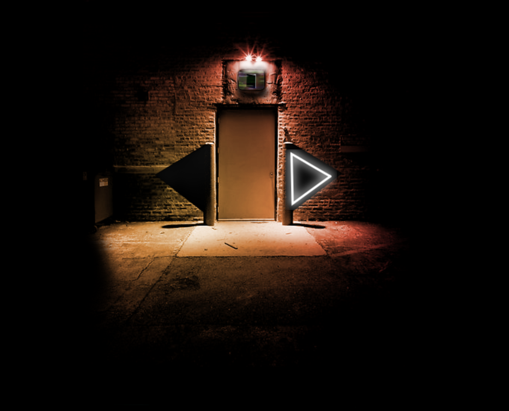

# MM/ART

MM/ART, a multimedia experience in the browser. A course project by me and Fabian Dophemont many years ago. It uses many experimental features of web technologies, including CSS3 animations.

The website might not work in a browser other than Chrome. Make sure your sound is on. The entry point is `Intro/intro.html`. **You can also conveniently preview the website [here](https://rawcdn.githack.com/overbk/mmart/3ec6142cbf7d37b79a6daced7d2e1bdd74dd6f1c/Intro/intro.html).**

If things don't work, hard refreshing usually seems to resolve the issue.

After the intro ends, click the buttons next to the door (portal) to cycle through four disciplines: literature, film, music, and photography. **The disciplines music and photography are not included here.** When a selection is made, enter through the door. Navigation in general is through doors. The rest hopefully speaks for itself.

I was mainly responsible for the literature and film rooms. Fabian was mainly responsible for the music and photography environments, as well as the intro. The portal involved effort from us both.
